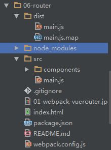

# vue路由实现单页面开发

上面的例子中实现了一个简单`vue`文件的加载，并且使用vue时让其进行自动刷新。

但最终目的是利用vue实现单页面应用程序(SPA)，这时就需要利用vue路由管理来进行SPA的开发。vue提供了一个官方库[vue-router](https://github.com/vuejs/vue-router)，并且配有对应的[中文文档](http://vuejs.github.io/vue-router/zh-cn/index.html)。

[TOC]

## vue组件

> [官网对于组件讲解](http://cn.vuejs.org/guide/components.html)


在`Vue`中定义一个组件非常简单，只需要一对**自定义标签**，在其中填入内容就可以进行我们的组件编写了，然后使用`Vue.component()`去注册我们的组件。

### 组件入门

```html
	<script src="js/vue.js></script>
	<body>
		<div id="app">
			<!-- 自定义标签作为组件名 -->
			<my-component></my-component>
		</div>
		<script>
			//定义并注册组件
			Vue.component('my-component',
				{template:'<div>A custom component</div>'}
			)
			//创建实例
			new Vue({
				el:'#app'
			})
		</script>
	</body>
	
```
定义和注册步骤也可分开
```js
var MyComponent = Vue.extend({
	template:'<div>A custom component</div>'
})

Vue.component('my-component',MyComponent)
```

渲染结果则是
```html
<div id="app">
	<div>A custom component</div>
</div>
```

### 使用template标签

在上面中组件的内容都写到了template标签中，假如组件的内容增加的话，让代码变得十分复杂。Vue引入了`template`标签来解决这一问题。

```html
<script src="js/vue.js"></script>
<body>
	<template id="temp">
        <h2>This is a template </h2>
        <p>some word ...</p>
    </template>
	<div id="app">
        <my-component></my-component>
		<my-component></my-component>
    </div>
	<script>
        Vue.component("my-component", {
            template:"#temp"//对应上面定义的template标签中的选择器
        })
        new Vue({
            el:"#app"
        });
    </script>
</body>
```

结果就是:
```
<div id="app">
	<h2>This is a template</h2>
	<p>some word ...</p>
	<h2>This is a template</h2>
	<p>some word ...</p>
</div>
```
显得不再那么繁琐

## vue-router

接下来就是想要学习的模块内容了。通过结合vue-router，来实现动态切换。

首先，使用`npm install vue-router --save-dev`进行安装。并使用`ES6`的语法进行引用,
```javascript
import Vue from "vue";
import VueRouter from "vue-router";
Vue.use(VueRouter);
```

### 起步

官方教材上的一些例子，不同的是采用了`CommonJS`的方法进行模块引用。

html:
```html
<div id="app">
  <h1>Hello App!</h1>
  <p>
    <!-- 使用指令 v-link 进行导航。 -->
    <a v-link="{ path: '/foo' }">Go to Foo</a>
    <a v-link="{ path: '/bar' }">Go to Bar</a>
  </p>
  <!-- 路由外链 -->
  <router-view></router-view>
</div>
```

javascript:
```javascript
// 定义组件
var Foo = Vue.extend({
    template: '<p>This is foo!</p>'
})
var Bar = Vue.extend({
    template: '<p>This is bar!</p>'
})
// 路由器需要一个根组件。
// 出于演示的目的，这里使用一个空的组件，直接使用 HTML 作为应用的模板
var App = Vue.extend({})
// 创建一个路由器实例
// 创建实例时可以传入配置参数进行定制，为保持简单，这里使用默认配置
var router = new VueRouter()
// 定义路由规则
// 每条路由规则应该映射到一个组件。这里的“组件”可以是一个使用 Vue.extend
// 创建的组件构造函数，也可以是一个组件选项对象。
// 稍后我们会讲解嵌套路由
router.map({
    '/foo': {
        component: Foo
    },
    '/bar': {
        component: Bar
    }
})
// 现在我们可以启动应用了！
// 路由器会创建一个 App 实例，并且挂载到选择符 #app 匹配的元素上。
router.start(App, '#app')
```

就实现了单页面的路由切换了，接下来就是利用`vue`文件来实现路由，文件目录结构:




### 定义路由规则

`main.js`:

```js
//引用使用模块
import Vue from "vue";
import VueRouter from "vue-router";
Vue.use(VueRouter);

//使用ES6的方法引入组件
import index from './components/app.vue'
import list from './components/list.vue'
import hello from './components/hello.vue'

//开启dubug模式
Vue.config.debug = true;

// 路由器需要一个根组件。
var App = Vue.extend({});

// 创建一个路由器实例
var router = new VueRouter();
// 映射一个组件
router.map({
    '/index':{
        name:'index',//定义路由的名字，方便使用。
        component:index,//引用的组件名称，对应上面使用`import`导入的组件
        //component:require("components/app.vue")//还可以直接使用这样的方式也是没问题的。不过会没有import集中引入那么直观
    },
    '/list': {
        name:'list',
        component: list
    },
});
router.redirect({//定义全局的重定向规则。全局的重定向会在匹配当前路径之前执行。
    '*':"/index"//重定向任意未匹配路径到/index
});
// 现在我们可以启动应用了！
// 路由器会创建一个 App 实例，并且挂载到选择符 #app 匹配的元素上。
router.start(App, '#app');
```


index.html:
```html
    <div id="app">
        <router-view></router-view>
    </div>
```

当运行`npm start`时，进入`localhost:8080`就会默认跳转到`localhost:8080/#!/index`

### 实现路由跳转

`app.vue`:

```html
<template>
<div>
	<div class="info">
		<h2>姓名：{{name}}</h1>
		<h2>{{age}}</h2>
	</div>
	<div class="btn">
		<button @click="golist">$route.router.go方法查看</button>
	</div>
	<div class="router">
		<a v-link="{ name: 'list' }">v-link查看列表</a>
		<a v-link="{ name: 'index' }">回去主页</a>
		<a v-link="{ name: 'hello' }">嵌套的路由</a>
	</div>
    <hello></hello>
    <router-view></router-view>

</div>
</template>

<script>
    import hello from "./hello.vue"
    export default {
        data () {
            return {
                name:"mike",
                age:"25"
            }
        },

        methods :{
            golist (){//方法，定义路由跳转，注意这里必须使用this，不然报错
                this.$route.router.go({name:"list"});
            }
        },
        components:{
            hello
        }


    }
</script>
```

### Vue组件的嵌套

在第一小点里面我们看到了在页面内的组件的使用方法，第二小点中学习到了`vue-router`的制定路由规则。

看过这两个地方之后，我们把思维发散开来，应该就能触类旁通的想到如何在页面中嵌套加载别的组件了。
我们创建一个`hello.vue` ，里面内容随意。现在我们如果要在`app.vue`中加载它，那么只需要在`app.vue`中使用`import hello from "./hello.vue"`（其实这个达到了使用require两步的效果。引入赋值）。

引入之后，只需要如下注册：

```js
export default {
    //其它的就
    components:{
        hello//若还有更多的组件，只需要在import的情况下，以逗号分割，继续注册就好
    }
}
```
最后在`app.vue`中添加`<hello></hello>`这一对自定义标签，就可以实现加载`hello.vue`中的内容。

组件的嵌套也就是这样，很简单的描述完了，但是怎么样去抽离组件，在工作中积累可以复用的组件才是我们真正需要去思考的。

### 路由嵌套

还是刚刚的代码与目录结构，我们已经实现了组件之间的嵌套，但是有时并不希望组件直接就加载进来，而是在用户点击后才展现在页面中，这是就需要使用到路由嵌套。

这里就直接使用`hello.vue`。实现嵌套路由主要有以下几步：


第一步：制定嵌套路由规则：

看`main.js`下面这部分的代码：

```js
router.map({
    '/index':{
        name:'index',
        component:index,
        // 在/index下设置一个子路由
        subRoutes:{ 
            // 当匹配到/index/hello时，会在index的<router-view>内渲染
            '/hello':{
                name:'hello',//可有可无，主要是为了方便使用
                // 一个hello组件
                component:hello
            }
        }
    },
});
```

第二步：在组件中添加`<router-view>`

> 来自官网的解释：`<router-view>` 用于渲染匹配的组件，它基于Vue的动态组件系统，所以它继承了一个正常动态组件的很多特性。

将`<router-view>`写在`app.vue`的`<template></template>`标签中。

第三步：写入跳转路径

还是在`app.vue`中：
```html
<a v-link="{ name: 'index' }">回去主页</a>
<!-- 点击这两个标签就会实现页面内的切换效果 -->
<a v-link="{ name: 'hello' }">嵌套的路由</a>
```
，切换到浏览器，点击该`嵌套的路由`即可让`hello.vue`中的展现出来，在这里直接使用了`v-link`来实现跳转（知道为什么要写name了吧。。如果使用path会是这样的`{ path: '/index/hello' }`- -。 ） ，当然`router.go`同理。（注意在点击两个不同的文字时，地址栏的变化，以及展现内容的切换）